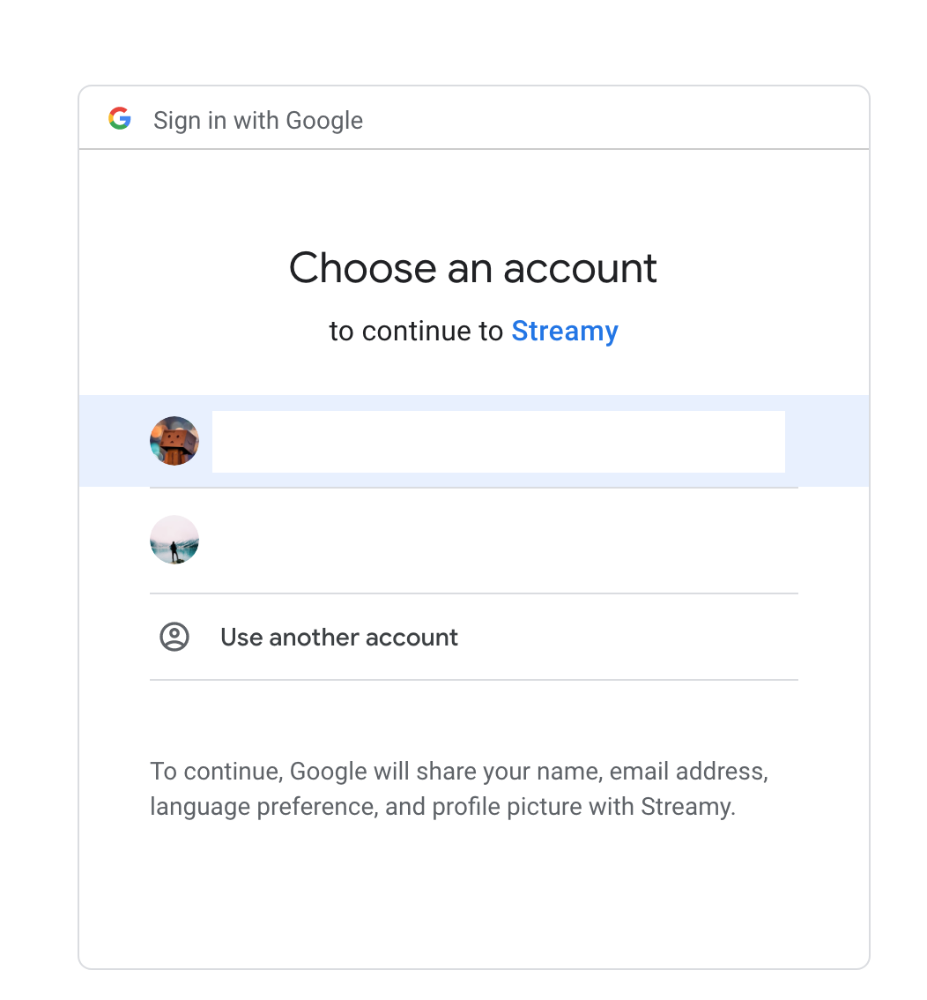
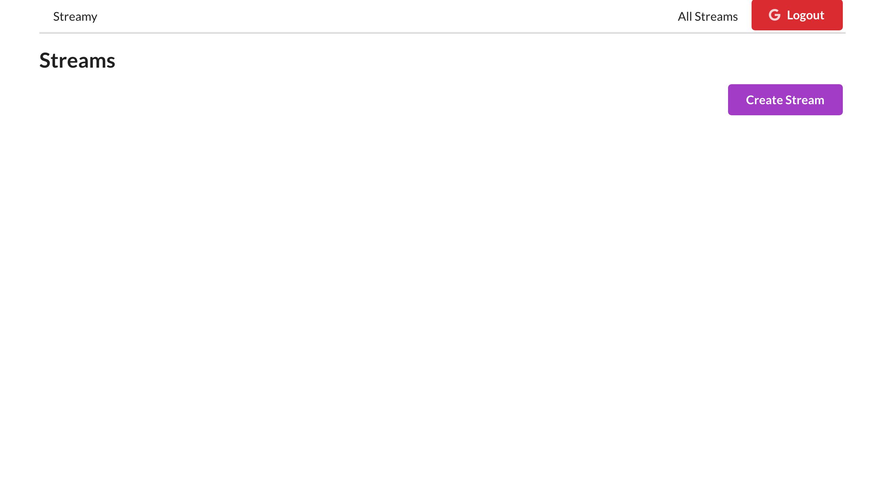
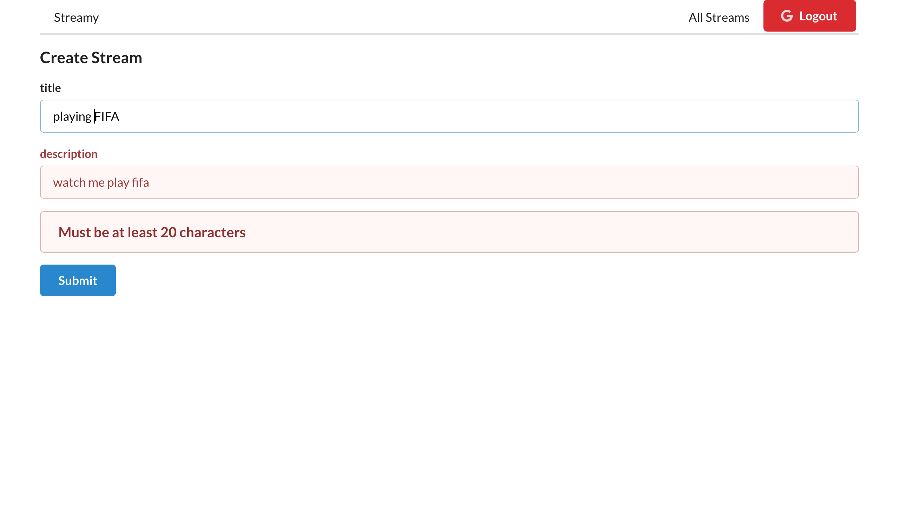
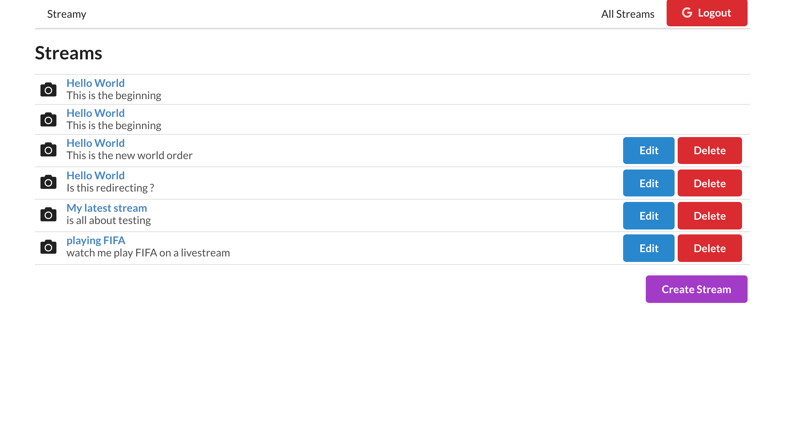
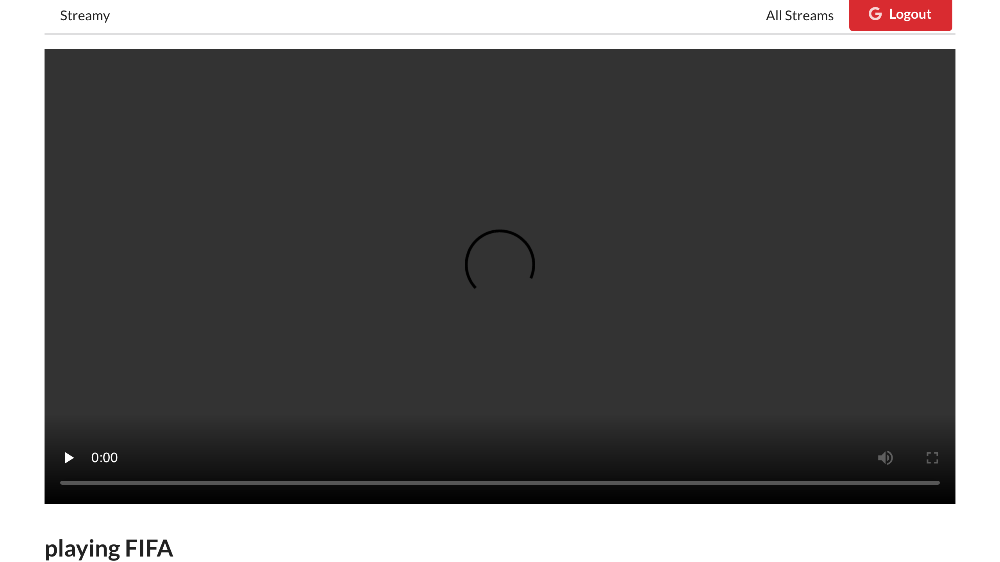
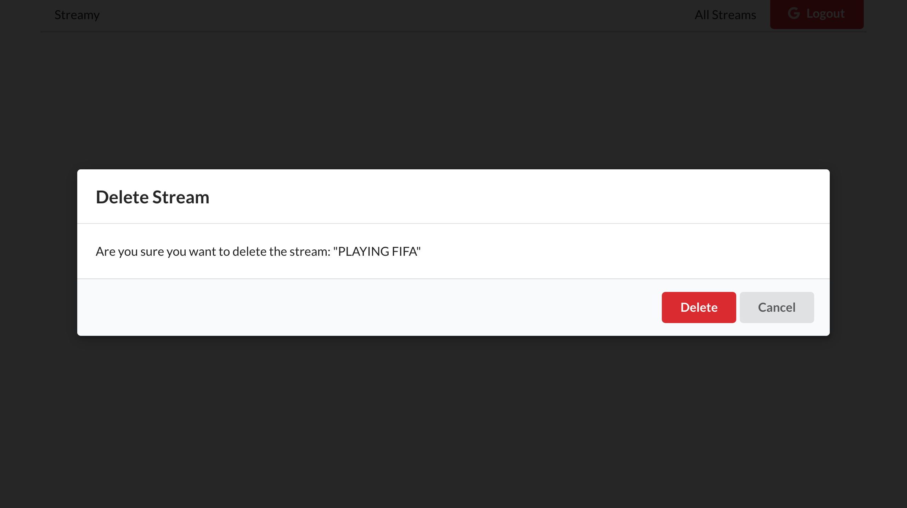

# Streamy

The application covers CRUD operations using `redux` as the central state
manager and `redux-form` for handling forms and validation. The backend API
is based on the `json-server` package and a JSON file as a database.

## Index

- [Streamy](#streamy)
  - [Index](#index)
  - [RTMP setup (OBS streaming software)](#rtmp-setup-obs-streaming-software)
  - [React](#react)
    - [App](#app)
    - [Header](#header)
    - [Stream](#stream)
      - [StreamCreate](#streamcreate)
      - [StreamIndex](#streamindex)
      - [StreamShow](#streamshow)
      - [StreamEdit](#streamedit)
      - [StreamDelete](#streamdelete)
      - [Partials](#partials)
        - [ErrorMessage](#errormessage)
        - [Modal](#modal)
        - [StreamForm](#streamform)
        - [StreamItem](#streamitem)
      - [Validators](#validators)
  - [Redux](#redux)
    - [Actions](#actions)
    - [Reducers](#reducers)
  - [APIs](#apis)
  - [Miscellaneous](#miscellaneous)
  - [Screenshots](#screenshots)

## RTMP setup (OBS streaming software)

> Settings -> Stream

Stream Type : Custom Streaming Server

URL : rtmp://localhost/live

Stream key : STREAM_NAME

to access the RTMP server use the stream key as the `{:id}` variable.
rtmp://localhost:8000/live/{:id}.flv

## React

The `react` part of the application consits of an app the holds the
`react-router`. Each CRUD operation has its own component inside the stream
folder.

### App

The App component renders the `react-router` with routes for each CRUD operation
and the Header of the app that persists across all routes.

### Header

The Header component persists across all routes and hold the
GoogleAuthentication component which is responsible for handling user
authentication using the google API.

### Stream

The stream folder holds all the Stream components accessible through the router
as well as partials to improve component reusability.

#### StreamCreate

Calls the `streamCreate` redux action which in turn creates a new Stream with
the `redux-from` values.

#### StreamIndex

Calls the `fetchStreams` redux action to load all the available streams.

#### StreamShow

Calls the `fetchStream` redux action to show a single stream using the router
`:id` parameter.

#### StreamEdit

Calls the `fetchStream` redux action with the router `:id` parameter to populate
the `redux-form` with the stream's values. After that, it calls the `streamEdit`
redux action to update the stream using `PATCH`.

#### StreamDelete

Calls the `fetchStream` redux action with the router `:id` parameter to prompt
the user a confimation dialogue using a `React Portal`. When the user confirms
the deletion the `deleteStream` redux action deletes the stream.

#### Partials

This folder includes components that are reused severaled times or improve the
readability of the components that use them.

##### ErrorMessage

This functional component displays a styled error message using the children
prop. It's main function is to make the [StreamForm](#streamform) more readable.

##### Modal

This is a Modal dialogue using `React Portal`. For reusability purposes it
accepts props for title, description, actions and dismiss handlers.

##### StreamForm

This component holds the form for creating and editing streams. `redux-forms`
handles the state management of the form.

##### StreamItem

Renders each stream of the list of streams and has event handlers for showing,
editing and deleting a stream.

#### Validators

This file holds the `redux-form` validators to keep the
[StreamForm](#streamform) cleaner.

## Redux

The redux part actions and reducers for stream CRUD operations, redux-form state
and google authentication state.

### Actions

The actions uses redux-thunk to handle async API calls and conditionally calling
other actions as is the case with the `onAuthChange` action which calls the
`signIn` or `signOut` action depending on the current google authentication
status.

### Reducers

Each action has it's own reducer and the `index.js` file combines them all
including the `redux-form`.

## APIs

The application uses 2 different APIs. The `googleAuthentication` API imports
the required Google API (gapi) files and setups the authentication with a
token and scope which any component can make use of. The `streams` API is much
simpler as it only preconfigures axios to make API calls in the redux actions
more concise.

## Miscellaneous

The `history` file creates a history object which the `react-router` uses. It's
main purpose is to provide a callable history object to allow redux actions and
components to redirect the user when needed. Redux actions fall out of the scope
of the `react-router`.

## Screenshots

